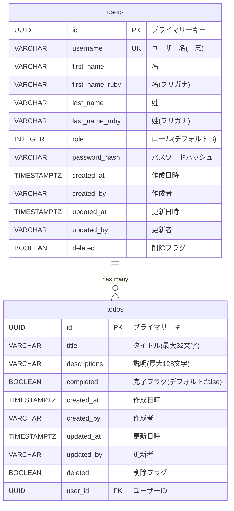

# データベースリレーション図

## ERダイアグラム

## テーブル概要

### users テーブル
ユーザー情報を管理するテーブル。

**主要カラム:**
- `id`: UUID型のプライマリーキー(自動生成)
- `username`: 一意のユーザー名
- `role`: ユーザーロール(デフォルト: 8)
- `password_hash`: ハッシュ化されたパスワード

**インデックス:**
- `idx_users_username`: username列にインデックス
- `idx_users_deleted`: deleted列にインデックス

### todos テーブル
TODO項目を管理するテーブル。

**主要カラム:**
- `id`: UUID型のプライマリーキー(自動生成)
- `title`: TODOのタイトル(最大32文字)
- `descriptions`: TODOの説明(最大128文字)
- `completed`: 完了状態(デフォルト: false)
- `user_id`: ユーザーへの外部キー

**インデックス:**
- `idx_todos_user_id`: user_id列にインデックス
- `idx_todos_deleted`: deleted列にインデックス

## リレーション

### users → todos (1対多)
- 1人のユーザーは複数のTODOを持つことができます
- `todos.user_id` が `users.id` を参照します
- `ON DELETE CASCADE`: ユーザーが削除されると、関連するTODOも自動的に削除されます

## 共通カラム

両テーブルには以下の監査用カラムが共通して含まれています:
- `created_at`: レコード作成日時(デフォルト: 現在時刻)
- `created_by`: レコード作成者(デフォルト: 'system')
- `updated_at`: レコード更新日時(デフォルト: 現在時刻)
- `updated_by`: レコード更新者(デフォルト: 'system')
- `deleted`: 論理削除フラグ(デフォルト: false)
